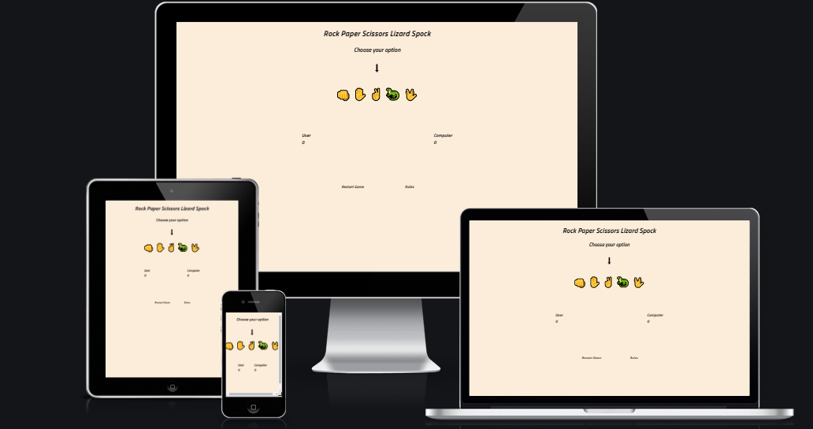
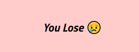

# Rock Paper Scissors Lizard Spock
This project uses javascript to run the game Rock Paper Scissors Lizard Spock.  
It allows the user to play the game verus program and keep score.  
  
## Features  
* Heading & Instructions  
    * Featured at the top of the page is the name of the game and below that are the directions/instructions on how to proceed  
    * An Arrow directs the users on where to click to play the game  
  
* User Choice Area  
    * This area is where the user choices their pick for the game  
    * They have all 5 options in emoji form for them to choose  
    * When an emoji is hovered over it scales so the user is able to see ther option better  
    * Once an option is choosen by the user, the game is run and the results are display below in the next section  
     
* Result Area  
    * This section is empty at first but after the user plays the game it showas the outcome of the game  
    * It has 3 different outcomes : "You Win", "It's a Draw", "You Lose"   
    * The outcome depends on if the user wins, draws or loses       
    * Also depending on the outcome of the game the entire background-color will change : Win = Green, Draw = Yellow and Lose = Red  
  
 
  
* Score  
    * This section shows the User's and the Computer's Score  
    * It also shows their last pick  
    
* Bottom Buttons  
    * There are 2 items here, a Restart Game button and a Rules button  
    * When the User clicks in the Restart Game Button the page refreshs  
    * When the User clicks on the the RUles option, they are taking to a new tab where the rules and orgin of the game are desribed 
    * These buttons scale when they are hovered over  
     
## Testing  
This game has been tested to ensure it runs effectively and as required  
The user and the randomized computer choices are compared agaisnt each other and a winner is found based on the rules of the game  
This has been check several times and the correct outcome appears everytime  
### Validator Testing  
* HTML  
    * No errors were returned when passing through the official [W3C HTML vaidator](https://validator.w3.org/nu/?doc=https%3A%2F%2Fanupd12.github.io%2Fportfolio_2%2F)  
* CSS  
    * No errors were found when passing through the official [Jigsaw validator](https://jigsaw.w3.org/css-validator/validator?uri=https%3A%2F%2Fanupd12.github.io%2Fportfolio_2%2F&profile=css3svg&usermedium=all&warning=1&vextwarning=&lang=en)  
* JavaScript  
    * No errors were found when passing through the official [JSHint](https://jshint.com/)  
        *There are 12 functions in this file  
        *Function with the largest signature take 1 arguments, while the median is 0  
        *Largest function has 9 statements in it, while the median is 1.5  
        *The most complex function has a cyclomatic complexity value of 6 while the median is 1  
## Deploment  
* The site was deployed to GitHub pages. The steps to deploy are as follows:   
    * In the GitHub repository, navigate to the Settings tab 
    * From the source section drop-down menu, select the Master Branch 
    * Once the master branch has been selected, the page will be automatically refreshed with a detailed ribbon display to indicate the successful deployment.  
The live link can be found here - https://anupd12.github.io/portfolio_2/  
## Credits  
The images used in this project are emojis on the windows client  
The Rules button links to a webpage 

